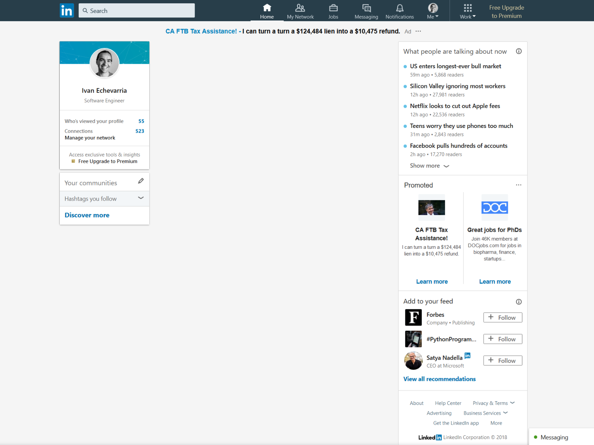

# linkedin-no-news-feed

linkedin-no-news-feed is a Firefox extension to remove the news feed from LinkedIn's site.

## Citations

- The code to listen for URL changes is based on Stack Overflow user <a href="https://stackoverflow.com/users/6586407/ztrat4dkyle">ztrat4dkyle</a>'s <a href="https://stackoverflow.com/questions/34957319/how-to-listen-for-url-change-with-chrome-extension/50548409#50548409">answer</a>. 
